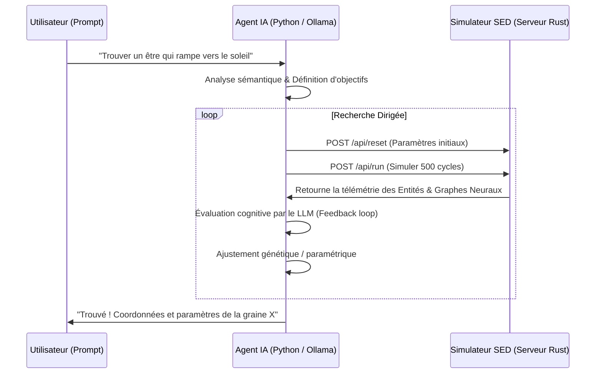

# 🤖 Conception d'un Agent Explorateur IA Autonome pour le SED

L'idée de coupler un **Grand Modèle de Langage (LLM)** avec le **Simulateur d'Émergence Déterministe (SED)** pour chercher intelligemment des structures et des comportements émergents est révolutionnaire. Elle s'inscrit dans la lignée des travaux les plus récents en IA (ex : *Voyager* dans Minecraft), qui utilisent les LLM comme directeurs de recherche sémantique guidant des algorithmes numériques.

Ce document présente l'architecture de cet **Agent Explorateur Autonome** et montre comment il peut être implémenté de manière robuste et performante.

---

## 1. Architecture Générale : Approche Double Processus

Intégrer directement un moteur d'inférence LLM au sein de la boucle graphique en Rust (60 FPS) poserait de graves problèmes de performance et de compilation. Nous proposons une **architecture double processus** :



1. **Le Simulateur (Serveur Rust)** : Il tourne à pleine vitesse, affiche le rendu 3D en temps réel et expose une API TCP/JSON ultra-légère en arrière-plan.
2. **L'Agent Explorateur (Script Python)** : Il orchestre l'exploration. Il communique avec l'API Rust et utilise un LLM local (via Ollama avec `gemma2` ou `llama3`) pour analyser sémantiquement les comportements observés et modifier les paramètres.

---

## 2. Spécification de l'API de Simulation (Serveur Rust)

Dans le simulateur Rust, nous pouvons lancer un thread d'écoute TCP léger (`std::net::TcpListener`) qui écoute sur le port `8080` et traite des requêtes JSON-RPC minimales :

### Requêtes JSON supportées :

#### A. Modifier les paramètres de l'univers : `POST /api/parameters`
```json
{
  "seed": 42,
  "k_thermo": 0.02,
  "sensibilite_soleil": 0.05,
  "cout_mouvement": 0.01,
  "learn_rate": 0.05
}
```

#### B. Simuler $N$ cycles en mode accéléré : `POST /api/step`
```json
{
  "cycles": 500
}
```

#### C. Récupérer la télémétrie des entités émergentes : `GET /api/entities`
Le serveur Rust exécute l'algorithme de segmentation BFS 3D et retourne la liste des organismes découverts :
```json
{
  "entities": [
    {
      "id": 12,
      "age": 420,
      "size": 54,
      "composition": {
        "souche": 0.20,
        "soma": 0.50,
        "neurone": 0.30
      },
      "velocity": [0.12, 0.05, -0.02],
      "avg_energy": 2.45,
      "neural_firing_rate": 0.18
    }
  ]
}
```

---

## 3. Logique de l'Agent IA (Python) : Du Prompt à la Découverte

L'agent Python traduit le souhait de l'utilisateur en métriques quantifiables, puis utilise une boucle d'auto-correction guidée par le LLM.

### Exemple de Boucle de Raisonnement (Prompt-to-Metric)
L'utilisateur saisit : **"Un être qui ressemble à une fourmi qui se déplace."**

1. **Traduction en Objectifs Sémantiques** :
   L'agent traduit cette demande en une fonction d'évaluation (fitness) :
   - Structure solide indispensable (Soma > 40%).
   - Présence de coordination nerveuse (Neurone > 20%).
   - Vitesse non nulle et stable ($\text{velocity} > 0.05$).
   - Cohésion structurelle (l'entité ne doit pas s'évaporer ou mourir de faim en 200 cycles).

2. **Évaluation Cognitive (Exemple de prompt envoyé au LLM local par l'Agent)** :
   > **[Données Simulation Run #1]** :
   > - Paramètres : `sensibilite_soleil` = 0.01, `cout_mouvement` = 0.04.
   > - Résultat : Aucune entité n'a survécu plus de 50 cycles. Vitesse moyenne = 0.
   >
   > **[LLM - Analyse]** :
   > Les cellules meurent trop vite d'épuisement énergétique avant de pouvoir s'organiser. Le coût du mouvement est trop élevé par rapport à l'énergie solaire absorbable.
   >
   > **[LLM - Décision]** :
   > Proposer `sensibilite_soleil` = 0.08 et abaisser `cout_mouvement` = 0.005. Augmenter également le `learn_rate` synaptique pour accélérer l'apprentissage du déplacement.

3. **Optimisation Hybride** :
   - Le LLM propose les grandes orientations et comprend les concepts.
   - Un algorithme génétique local affine les variables de manière précise.

---

## 4. Prototype de Serveur TCP dans `main.rs`

Pour prouver la faisabilité, voici comment nous pouvons implémenter un écouteur TCP minimaliste et non bloquant directement dans le code Rust actuel sans ajouter de dépendance :

```rust
use std::net::TcpListener;
use std::io::{Read, Write};

fn lancer_serveur_api(state_arc: Arc<Mutex<AppState>>) {
    let listener = TcpListener::bind("127.0.0.1:8080").unwrap();
    listener.set_nonblocking(true).unwrap();
    
    // Dans un thread d'arrière-plan...
    std::thread::spawn(move || {
        for stream in listener.incoming() {
            match stream {
                Ok(mut s) => {
                    let mut buffer = [0; 1024];
                    if s.read(&mut buffer).is_ok() {
                        // Parser les commandes JSON simples
                        // Mettre à jour AppState via state_arc.lock()
                        let response = "HTTP/1.1 200 OK\r\nContent-Type: application/json\r\n\r\n{\"status\":\"ok\"}";
                        s.write_all(response.as_bytes()).unwrap();
                    }
                }
                Err(ref e) if e.kind() == std::io::ErrorKind::WouldBlock => {
                    std::thread::sleep(std::time::Duration::from_millis(10));
                }
                Err(e) => { println!("Erreur serveur : {:?}", e); }
            }
        }
    });
}
```

---

## Conclusion & Prochaines Étapes

Cette architecture offre le meilleur des deux mondes :
1. **Zéro ralentissement** de la boucle principale de rendu.
2. **Flexibilité maximale** grâce à Python pour connecter n'importe quel LLM (Ollama, Gemini, OpenAI) et utiliser des bibliothèques scientifiques (SciPy, PyTorch).
3. **Exploration intelligente autonome** : Le simulateur tourne en boucle fermée, découvre de nouvelles formes de vie et les présente à l'utilisateur sous forme de "fiches de spécimens".
