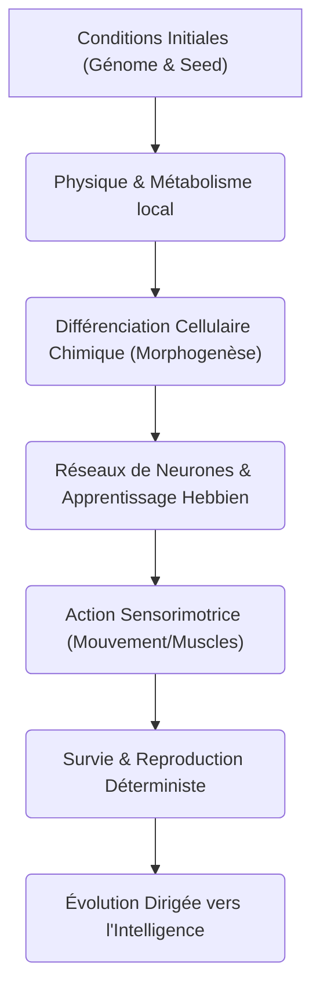

# 🔬 Évaluation Critique de l'Émergence de la Vie Intelligente dans le SED

Ce document présente une analyse rigoureuse et sans concession des fondements théoriques, des limites actuelles et des pistes d'amélioration du **Simulateur d'Émergence Déterministe (SED)** pour démontrer la transition d'un univers déterministe vers la vie et l'intelligence émergentes.

---

## 1. Confrontation aux Limites Actuelles du SED

Bien que le SED démontre des propriétés de persistance métabolique et de plasticité synaptique (apprentissage hebbien), plusieurs choix de conception limitent sa capacité à prouver une *émergence pure* de la vie intelligente.

### A. La Spécialisation Figée des Cellules (vs Émergence Géométrique)
Dans le Jeu de la Vie de Conway, il n'existe qu'**un seul type de cellule** (vivante ou morte). Toute la complexité (planeurs, oscillateurs, portes logiques, machines de Turing) émerge exclusivement de la configuration spatiale et de règles locales élémentaires.
*   **Le problème dans le SED** : Nous introduisons des types cellulaires prédéfinis (`Souche`, `Soma`, `Neurone`, `Static`). Les fonctions sont codées en dur (le neurone conduit l'électricité, le soma gère la structure). C'est de la **complexité injectée par le concepteur**, et non de l'émergence pure.
*   **Doute** : Si l'intelligence émerge parce que nous avons explicitement codé un type "Neurone" avec des règles d'apprentissage, avons-nous réellement prouvé l'émergence de l'intelligence, ou avons-nous simplement écrit un réseau de neurones classique déguisé en automate cellulaire ?

### B. L'Absence de Boucle Sensorimotrice
L'intelligence (au sens cognitif moderne, ex: Francisco Varela et l'autopoïèse) nécessite une interaction active avec l'environnement : percevoir, décider, agir.
*   **Le problème dans le SED** : Les cellules du SED sont fixes sur une grille tridimensionnelle. Le réseau de neurones formé par les cellules `Neurone` traite des signaux électriques (spikes), mais **il n'a aucun moyen d'action physique** (pas de mouvement, pas d'effecteurs). Le réseau est un spectateur passif du métabolisme.
*   **Doute** : Un réseau électrique fermé qui ne contrôle rien ne peut pas manifester d'intelligence active. Sans actionneur, il est impossible de prouver une adaptation intelligente.

### C. La Taille et la Résolution du Monde (Limitation d'Échelle)
La complexité émergente requiert de l'espace. Dans le Jeu de la Vie, des millions de cellules sont nécessaires pour construire des auto-réplicateurs complexes (comme le constructeur universel de Von Neumann).
*   **Le problème dans le SED** : Les simulations typiques tournent sur des grilles de $24^3$ à $64^3$. À cette échelle, le nombre de neurones et de connexions possibles est trop restreint pour voir émerger des structures cognitives complexes ou des comportements coordonnés à grande échelle.

### D. L'Absence de Pression Sélective et de Génétique
Pour que la vie intelligente émerge et se stabilise, elle doit évoluer.
*   **Le problème dans le SED** : La division cellulaire dans le SED est purement régie par un surplus d'énergie locale. Il n'y a pas de "génome" transmis d'une cellule à ses descendantes avec de légères variations déterministes.
*   **Doute** : Sans transmission d'informations héritables (génotype) et sans sélection naturelle déterministe (les structures inefficaces meurent et libèrent l'espace pour les plus adaptées), le système tend soit vers une saturation chaotique (cristallisation), soit vers une mort thermique globale, sans évolution vers une complexité supérieure.

---

## 2. Propositions d'Améliorations Majeures

Pour faire du SED le véritable successeur du Jeu de la Vie de Conway et prouver scientifiquement l'émergence de la vie intelligente, nous proposons les axes de développement suivants :

### Axe 1 : Remplacer les Types Cellulaires par un Génome Chimique local (Modèle Continu)
Au lieu de forcer une cellule à être un `Soma` ou un `Neurone`, chaque cellule devrait posséder un vecteur d'expression génétique (ex: des variables continues de concentrations chimiques internes).
*   **Règle d'émergence** : Selon les signaux chimiques reçus de ses voisines et sa propre concentration, une cellule exprime un comportement structurel (résistance physique), métabolique (absorption d'énergie) ou conducteur (potentiel électrique).
*   **Impact** : Les types "Soma" et "Neurone" émergeront alors naturellement sous forme de motifs stables (morphogenèse), tout comme les tissus se différencient dans un embryon réel.

### Axe 2 : Introduire des Cellules Contractiles et Actives (Mouvement)
Pour clore la boucle sensorimotrice, nous devons permettre au réseau de neurones d'agir sur le monde physique.
*   **Ajout proposé** : Un type de cellule contractile (cellule "Muscle") dont le volume ou la position change en fonction du potentiel électrique reçu.
*   **Mécanisme** : En se contractant et en se relaxant de manière coordonnée, ces cellules peuvent faire ramper ou nager une structure multicellulaire dans le monde en 3D.
*   **Intelligence émergente** : Le réseau de neurones devra apprendre (par plasticité hebbienne déterministe) à coordonner les contractions pour se diriger vers les sources d'énergie (la lumière du soleil).

### Axe 3 : Intégrer un Système de Transcription Génétique Déterministe
Chaque cellule possède une chaîne de caractères (ADN) représentant ses règles de transition.
*   Lors de la division, cet ADN est copié.
*   Avec une probabilité déterministe (basée sur la seed globale et les coordonnées de la cellule), des mutations se produisent dans cette chaîne.
*   Les organismes multicellulaires qui coopèrent le mieux (échange d'énergie par osmose, signalisation électrique de danger) survivront plus longtemps et transmettront leur ADN, initiant un processus d'évolution darwinienne déterministe.

### Axe 4 : Algorithme Hashlife 3D Sparse
Pour lever la barrière de la taille de la grille, le SED doit utiliser des structures de données extrêmement avancées.
*   L'adaptation de l'algorithme **Hashlife** en 3D pour les états continus ou discrets permettrait de simuler des milliards de voxels sur de très longues périodes temporelles en exploitant les redondances spatiales et temporelles de l'univers déterministe.

---

## 3. Le SED comme successeur de Conway

Le Jeu de la Vie a prouvé que la Turing-complétude pouvait émerger de règles binaires simples. Le SED a le potentiel de prouver que **l'autopoïèse et la cognition** peuvent émerger de règles physiques et neurales locales tridimensionnelles.

En intégrant la boucle sensorimotrice (Axe 2) et la morphogenèse chimique (Axe 1), le SED cessera d'être un "simulateur programmé" pour devenir un véritable **incubateur de vie artificielle intelligente**.
