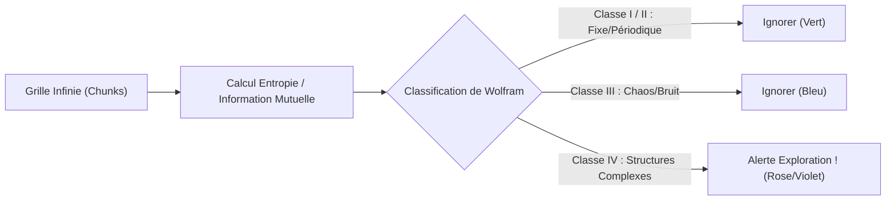

# 🔬 Méthodes et Outils d'Exploration de l'Intelligence Émergente dans le SED

L'exploration de l'émergence au sein du **Simulateur d'Émergence Déterministe (SED)** est confrontée à deux défis majeurs :
1. **L'immensité de l'espace des paramètres** (thermodynamique, métabolisme, plasticité synaptique, etc.).
2. **L'infini de la grille tridimensionnelle**, où des structures intéressantes peuvent apparaître et mourir loin de la caméra sans jamais être détectées.

Ce document propose des **outils d'exploration et d'analyse concrets** intégrables directement dans le logiciel pour identifier, suivre et étudier scientifiquement des comportements intelligents sans recourir à des millions d'itérations aléatoires.

---

## 1. Segmentation et Suivi Automatique d'Entités (Multi-Cellular Tracking)

Au lieu de considérer la grille comme une soupe de voxels individuels, le logiciel doit regrouper dynamiquement les cellules connectées pour identifier des "organismes".

### Algorithme de Segmentation (Connected Components)
- À intervalles réguliers (ex : tous les 10 cycles), un algorithme de parcours en largeur (BFS) tridimensionnel regroupe les cellules adjacentes vivantes.
- Chaque groupe se voit attribuer un identifiant unique (ex: **Entité #104**).

### Télémétrie UI de l'Organisme
Nous proposons d'ajouter un onglet **"Entités Actives"** dans l'interface [main.rs](file:///c:/Users/Administrator/Documents/Simulateur-d-emergence-D-eterministe-main%20%281%29/Simulateur-d-emergence-D-eterministe-main/src/main.rs) :
- **Tableau de bord des entités** : Affiche la liste des organismes triés par taille, âge, ou activité neurale.
- **Auto-Focus** : Cliquer sur une entité déplace instantanément la caméra orbitale ([AppState::cam_target](file:///c:/Users/Administrator/Documents/Simulateur-d-emergence-D-eterministe-main%20%281%29/Simulateur-d-emergence-D-eterministe-main/src/main.rs)) sur son centre de gravité.
- **Fiche d'identité biologique** :
  - **Composition** : % de cellules `Souche`, `Soma`, `Neurone`.
  - **Bilan Énergétique** : Taux d'osmose interne et consommation métabolique.
  - **Activité Électrique** : Taux moyen de décharge électrique (spikes).

---

## 2. Détecteur d'Entropie et de Complexité Spatio-Temporelle

Pour éviter de chercher au hasard sur la grille infinie, le système doit cartographier les zones où l'activité n'est ni triviale (mort thermique/cristallisation vide) ni purement chaotique (bruit thermique).

### Mesure de l'Entropie Locale
- Pour chaque chunk actif dans [world.rs](file:///c:/Users/Administrator/Documents/Simulateur-d-emergence-D-eterministe-main%20%281%29/Simulateur-d-emergence-D-eterministe-main/src/simulation/world.rs), on calcule la variance temporelle des variables d'état (énergie $e$, potentiel neural $p$, charge émotionnelle $c$).
- **L'Indice de Complexité** combinera l'Entropie de Shannon et l'information mutuelle spatiale :
  $$I_{complexite} = H(temps) \times (1 - H(espace))$$
- **Visualisation par "Heatmap"** : Ajout d'un mode de rendu affichant les chunks sous forme de volumes semi-transparents colorés selon leur indice de complexité. Les zones à forte complexité (le "bord du chaos", là où se loge l'intelligence) clignotent en violet/rose.

---

## 3. Oscilloscope Neural et Électrophysiologie Virtuelle

Pour comprendre si un réseau de neurones exprime un comportement cognitif (comme des boucles de rétroaction, de la mémoire ou des rythmes), l'utilisateur doit disposer d'outils de mesure similaires à ceux des neurosciences.

### Électrodes Virtuelles
- Permettre à l'utilisateur de placer une "électrode de mesure" en faisant un clic droit sur une cellule `Neurone` via l'inspecteur de [main.rs](file:///c:/Users/Administrator/Documents/Simulateur-d-emergence-D-eterministe-main%20%281%29/Simulateur-d-emergence-D-eterministe-main/src/main.rs).
- Enregistrer le potentiel $p$ de cette cellule au cours du temps.

### Analyse Fréquentielle (EEG Virtuel)
- Afficher un graphique en temps réel (oscilloscope) du potentiel électrique du neurone sélectionné.
- Calculer une transformée de Fourier rapide (FFT) sur les 128 derniers cycles pour détecter la présence de fréquences dominantes (rythmes analogues aux ondes $\theta$, $\alpha$ ou $\gamma$ cérébrales). Des oscillations stables signent la présence de boucles de rétroaction fonctionnelles, briques élémentaires de la mémoire à court terme.

---

## 4. Cartographie du Paysage des Paramètres (Auto-Tuning Métabolique)

Au lieu de faire varier manuellement les douzaines de constantes de [ParametresGlobaux](file:///c:/Users/Administrator/Documents/Simulateur-d-emergence-D-eterministe-main%20%281%29/Simulateur-d-emergence-D-eterministe-main/src/simulation/params.rs), nous pouvons déléguer la recherche de la "zone de vie" à un agent d'exploration déterministe.

### Recherche par Descente de Gradient Métabolique
- Lancer en tâche de fond (multithreadée via `rayon`) des mini-simulations isolées dans des secteurs éloignés de la grille infinie.
- Chaque secteur teste un jeu de paramètres légèrement modifié.
- **Fonction de Fitness** (à maximiser) :
  $$F = \text{Durée de vie moyenne des cellules} \times \text{Diversité cellulaire} \times \text{Nombre de spikes neuronaux coordonnées}$$
- Le système ajuste dynamiquement les curseurs physiques de la simulation principale pour guider l'utilisateur vers les combinaisons de paramètres propices à l'auto-organisation.

---

## 5. L'Incubateur de Mutagénèse Déterministe (Le "Laboratoire")

Une fois qu'une structure multicellulaire intéressante est repérée (par exemple, une colonie capable de survivre 500 cycles), l'utilisateur doit pouvoir mener des expériences d'évolution dirigée.

### Outils de Laboratoire UI :
1. **Bistouri Chimique** : Permet de couper ou supprimer des morceaux d'un organisme directement en cours de fonctionnement pour observer ses capacités de régénération ou la résilience de son réseau neuronal.
2. **Générateur de Clones / Mutants** :
   - Exporter l'entité sous forme de fichier scénario JSON.
   - Ré-injecter automatiquement 10 versions légèrement modifiées (mutées) de cette entité dans des secteurs isolés.
   - Comparer leur efficacité énergétique et leur capacité à apprendre à s'adapter (par plasticité hebbienne).

---

## Conclusion

Ces fonctionnalités transformeraient le SED d'un simple visualiseur interactif en un **laboratoire de biologie théorique assisté par ordinateur**. L'automatisation de la détection de la complexité spatio-temporelle et le suivi des entités multicellulaires permettraient de découvrir les règles d'émergence de la cognition de manière ciblée, rigoureuse et rapide.
